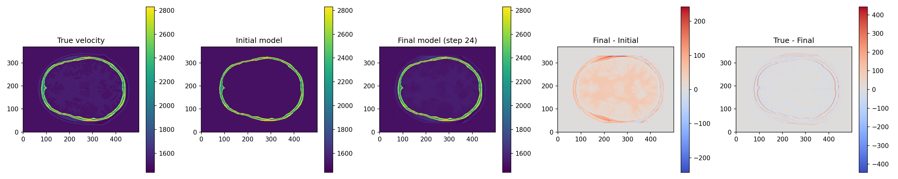
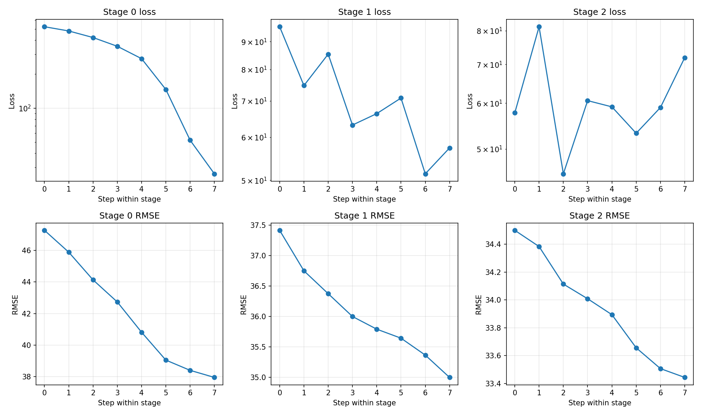
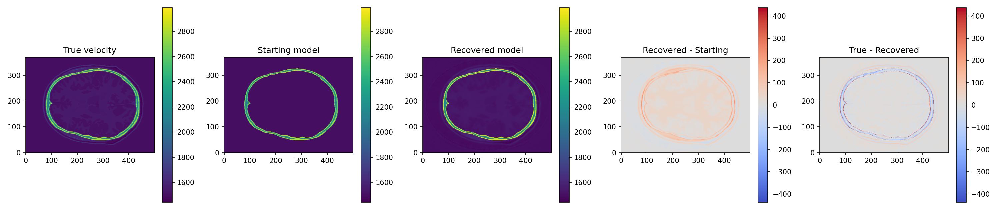
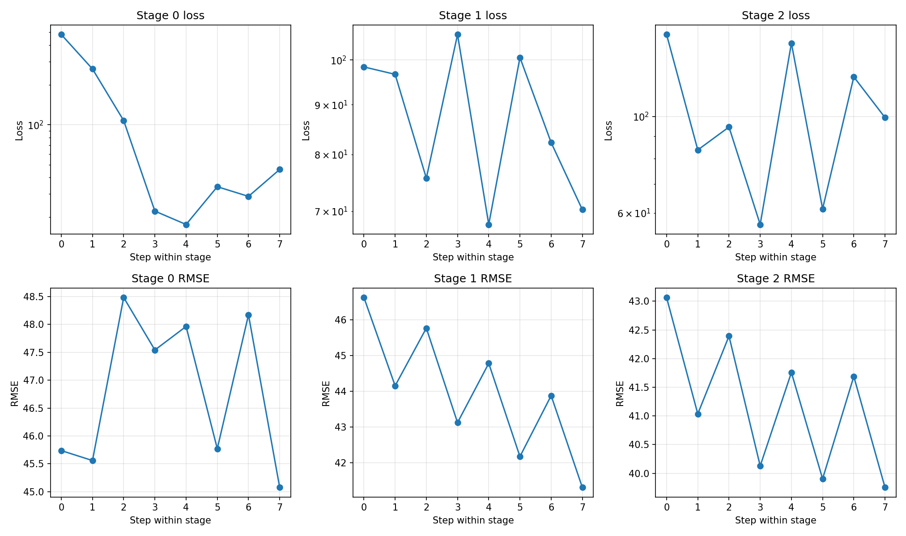

# Meta-Learning Optimisation for Full-Waveform Inversion (FWI)

This repository contains the implementation of my MSc Individual Research Project at Imperial College London.

## 📌 Overview

Full-waveform inversion (FWI) is a powerful technique for reconstructing high-resolution acoustic velocity models from wavefield data. However, it is computationally expensive and highly non-convex.

This project explores **meta-learning optimisation strategies** for FWI, where the goal is to learn improved update rules instead of hand-designing optimisation algorithms.

The approach combines:

* Differentiable physics (forward and adjoint wave solvers)
* Learned optimisation methods
* Gradient-based inverse problem frameworks

## 🎯 Objectives

* Develop a differentiable FWI pipeline using JAX
* Design a meta-learned optimiser for iterative reconstruction
* Compare learned optimisation against classical methods (e.g. SGD, Adam, L-BFGS)
* Evaluate convergence speed, reconstruction quality, and robustness

## 🛠️ Tech Stack

* Python
* JAX
* NumPy / SciPy
* Matplotlib

## 📂 Repository Structure (Planned)

```text
src/            # Core implementation (FWI, optimisers, models)
experiments/    # Experiment scripts, outputs, and configurations
notebooks/      # Exploratory analysis and visualisations
data/           # Synthetic datasets and small cached artefacts
resources/      # Local reference material (ignored by git)
tests/          # Smoke tests for the baseline implementation
```

## 🚧 Status

This project is currently in early development.

Phase 1 now includes a runnable baseline for a synthetic brain-imaging FWI problem:

* A differentiable 2D acoustic wave solver implemented directly in JAX
* An explicit adjoint-state gradient in JAX, exposed through the shared FWI problem API
* Stride-inspired elliptical acquisition geometry for brain ultrasound
* A procedural brain phantom with skull, ventricles, and lesion structure
* Classical optimisation baselines using SGD, Adam, and L-BFGS-B
* Basic evaluation metrics for model and data misfit
* A lightweight wrapper for the bundled Stride scripts so the reference brain
  example can be run as a benchmark outside the differentiable JAX path
* A shared acquisition/problem API so experiments can inspect JAX and Stride
  workflows through one common surface
* A Stride-oriented Phase 1 configuration that now uses the tracked benchmark's
  `500 x 370` grid, `256`-location acquisition ring, `2500` time samples,
  `0.25 MHz` `3`-cycle tone-burst source family, Stride-style `0.5 * sum(r^2)`
  loss scaling, and a band-limited `f_max` continuation schedule

The repository also contains local reference resources from Stride and Descend under `resources/`. Those files are currently used as design references rather than imported runtime dependencies.

## 🚀 Research Roadmap

The project will be developed progressively, starting from simple and interpretable baselines towards more advanced learned optimisation strategies.

### Phase 1 — Classical FWI Baseline

* Implement differentiable FWI with forward and adjoint solvers
* Optimisation using standard methods (SGD, Adam, L-BFGS)
* Establish baseline performance and evaluation metrics

Current implementation note:

* The active baseline keeps the forward solver in JAX and now uses an explicit JAX adjoint-state implementation for `dldx`.
* The JAX baseline is the research path for differentiable optimisation and future meta-learning experiments.
* The explicit adjoint is written purely in JAX, so higher-order meta-gradients remain available for learned-optimiser experiments.
* The local Stride scripts under `resources/stride_fwi_brain/` are treated separately as a benchmark path rather than part of the end-to-end autodiff stack.

### Phase 2 — Meta-Learned Scalar Optimisation

* Learn global optimisation hyperparameters (learning rate, momentum)
* Explore time-dependent or piecewise schedules
* Compare against classical optimisers

### Phase 3 — Spatially Adaptive Updates

* Learn spatially varying step sizes (diagonal preconditioning)
* Introduce simple learned mappings from gradients to updates

### Phase 4 — Learned Update Operators

* Parameterise update rules using neural networks (e.g. CNNs)
* Incorporate gradient history and optimisation state
* Study stability and generalisation

### Phase 5 — Geometry-Aware Optimisation

* Explore structured update rules inspired by non-Euclidean optimisation
* Investigate connections to Bregman distances and learned metrics

### Phase 6 — Uncertainty-Aware Optimisation (Exploratory)

* Model uncertainty in update steps (stochastic optimisation)
* Investigate its role in exploration vs refinement
* Explore uncertainty-based stopping criteria

### Phase 7 — Evaluation and Analysis

* Benchmark across synthetic datasets
* Analyse convergence behaviour and robustness
* Study generalisation across different problem instances

## 📖 References

* Adler & Öktem (2017) — Learned iterative reconstruction
* Andrychowicz et al. (2016) — Learning to learn by gradient descent
* Benning et al. (2021) — Bregman optimisation methods

A more explicit running list of papers, software packages, and local benchmark
sources used by the repository lives in [REFERENCES.md](/home/fgr25/IRP/IRP-Meta-learning/REFERENCES.md).

## 🔗 Related Work

- Descend (Moseley et al., 2024): https://gitlab.com/benmoseley/descend-pmlr-2024

## ▶️ Running The Phase 1 Baseline

The baseline experiment entrypoint is:

```bash
PYTHONPATH=src python experiments/phase1_brain_fwi.py
```

This experiment is intentionally JAX-only so the optimisation path remains
fully differentiable.

Implementation note:

* `fwi.problem.build_brain_fwi_problem(...)` now returns a structured `FWIProblem` object with a shared `acquisition` description.
* `fwi.problem.dldx(...)` uses the JAX backend's explicit adjoint-state routine rather than relying on generic reverse-mode differentiation through the full time loop.

Useful options include:

* `--optimizer {sgd,adam,lbfgsb}`
* `--max-freqs-hz` to set the Stride-like `f_max` continuation schedule
* `--shots-per-iter` and `--seed` to control the random shot subsets
* `--final-shots N` to evaluate final data-domain metrics on a deterministic shot subset instead of all shots
* `--checkpoint-interval` to trade extra recomputation for lower adjoint memory
* `--forward-shot-batch-size` to control forward-only survey batching (diagnostics/metrics): `1` is lowest memory, larger values can improve throughput
* `--grad-shot-batch-size` to control forward+adjoint shot batching during gradient accumulation: `1` is lowest memory, larger values can improve throughput
* `--shot-reduction {sum,mean}` to control whether selected-shot losses are summed (Stride parity default) or averaged before each update
* `--source-window-enabled`, `--source-window-alpha`, `--source-window-start`, and `--source-window-stop` to control Stride-like Tukey source preprocessing before injection
* `--print-shot-progress` to print active source IDs for each step (useful for long runs)
* `--stride-grad-processing`, `--mask-grad`, `--grad-mask-rampoff`, `--smooth-grad`, `--norm-grad`, `--grad-smooth-sigma`, `--grad-smooth-radius`, `--grad-norm-guess-change`, and `--grad-global-norm` to control Stride-like global gradient processing before each update
* `--damping-mode {legacy,stride_like,sponge2}` plus damping profile options (`--damping-type`, `--damping-cells`, `--damping-power-degree`, `--damping-reflection-coefficient`) to compare boundary treatments. If reflection is omitted, the default follows Stride's absorbing-width heuristic.
* `--density-model`, `--attenuation-model`, and `--attenuation-power` to enable fixed extra medium terms in the JAX solver
* `--interpolation-type {linear,hicks}` to select source/receiver interpolation
* `--apply-coordinate-epsilon` and `--coordinate-epsilon-scale` to control the Stride-style coordinate perturbation used before Hicks sparse interpolation setup
* `--fw3d-mode`, `--stride-trace-processing`, `--stride-trace-filter-wavelets`, `--stride-trace-filter-traces`, `--stride-trace-mute-first-arrival`, `--stride-trace-mute-traces`, `--stride-trace-norm-per-shot`, `--stride-trace-scale-per-shot`, and `--stride-trace-time-tweaking` to control Stride-like trace-conditioning step flags in the JAX misfit path (note: in the tracked local Stride bundle, `mute-first-arrival` and `time-tweaking` are declared but missing, so both are effective no-ops)
* `--trace-filter-relaxation-wavelets` and `--trace-filter-relaxation-traces` to match Stride's separate wavelet-side and trace-side relaxation factors
* `--stride-trace-time-weighting`, `--stride-trace-time-weight-power`, `--stride-trace-time-weight-start`, and `--stride-trace-time-weight-stop` to enable and configure an optional differentiable time-weighting stage in the trace misfit path
* `--jax-enable-x64` to toggle JAX float64 mode explicitly for numerical-parity studies; metrics now record backend and precision settings
* `--nx`, `--ny`, `--nt` to override the benchmark-aligned spatial and temporal defaults
* `--n-transducers`, `--n-shots` to adjust acquisition cost or available shot pool

Outputs are written to `experiments/outputs/phase1_brain_fwi/` and include:

* reconstruction plots
* scalar metrics in JSON
* optimisation history in JSON
* a `<optimizer>_RUN_COMPLETE.json` marker written at successful end-of-run

### Representative Full Run Snapshot

On our local CPU setup, this full `24`-step run (3 blocks × 8 steps, benchmark-scale grid and acquisition) took about **8 hours 19 minutes** wall-clock time.

#### Figure 1: Phase 1 Reconstruction (`sgd_reconstruction.png`)



Side-by-side comparison of the true model, starting model, and final recovered model after 24 steps, plus difference maps. This is the quickest visual check for whether inversion recovers skull/brain structure and whether updates move in the expected direction.

Observed outcome from this run:

* The inversion clearly updates the **interior brain region** away from the smooth start and in the correct direction, but recovery is still **incomplete** after 24 steps.
* The **skull/high-contrast boundary** is recovered more strongly than deep interior details, which is expected in early/intermediate FWI stages and indicates a boundary-dominated sensitivity pattern.
* The `True - Final` map shows residual structure inside the head, confirming meaningful progress with remaining model mismatch that likely needs longer runs and/or stronger interior-focused conditioning.

#### Figure 2: Phase 1 Optimisation History (`sgd_history.png`)



Per-stage optimisation curves (loss and RMSE when available). Since the objective changes across continuation stages, this plot is best interpreted for monotonicity and stability *within* each stage rather than by directly comparing raw loss values across stages.

Observed outcome from this run:

* **RMSE decreases consistently in all three stages**, showing steady model improvement over the full continuation schedule (about `47.2 -> 35.0 -> 33.4` by stage endpoints).
* **Loss is smooth in Stage 0** (low-frequency regime), then becomes more oscillatory in Stages 1-2 as higher frequencies are introduced and shot subsets vary per iteration.
* The combination of oscillatory loss with still-decreasing RMSE is consistent with **useful but noisy high-frequency updates**: the inversion keeps improving the model overall, even when per-step misfit is non-monotonic.

Runtime troubleshooting:

* If logs show `An NVIDIA GPU may be present ... Falling back to cpu`, your
  environment has CPU-only `jaxlib`. Install a CUDA-enabled JAX build for your
  CUDA version, then verify with:

```bash
python -c "import jax; print(jax.devices())"
```

* In this environment, `ruff` from `/snap/bin/ruff` fails due runtime-dir
  restrictions. Use a non-snap binary for lint checks, for example:

```bash
/home/fgr25/miniconda3/envs/mpm2025/bin/ruff check .
```

* Hicks interpolation now converts grid-index transducer coordinates to
  physical coordinates before building Stride-style precomputed coefficients.
  If you ever see a run where Hicks mode reports near-zero loss and gradient at
  every step, double-check that you are on a version containing this fix.

The script now writes reconstruction/history artifacts before the expensive
final full-survey metric pass, so late memory failures no longer leave those
plots stale from a previous run.

The core implementation lives directly under `src/fwi/` so imports stay short and explicit, for example `from fwi.problem import init_params`.

Parity note:

* The JAX baseline now intentionally tracks several Stride inverse-script choices more closely: the same benchmark-scale geometry/time defaults, SGD with step size `5` as the default optimiser, random `32`-shot subsets per iteration, a `3`-block `f_max` schedule `[0.1, 0.2, 0.3] MHz`, and Stride-style L2 loss scaling.
* Random shot scheduling now also mirrors Stride's queue-based selection semantics more closely: shot IDs are drawn from a persistent random permutation (sorted per iteration), so repeats are avoided until the queue is exhausted and boundary iterations may contain fewer than `shots_per_iter` shots.
* The JAX solver now also mirrors several discrete `IsoAcousticDevito` choices more directly: `OT4` time stepping by default, Stride-style source scaling `2 * dt**2 * vp / max(dx, dy)` with optional `diff_source`, and an explicit adjoint built from the exact linearisation of that discrete update.
* The JAX acquisition path now supports Stride-style `hicks` interpolation with precomputed sinc/Kaiser coefficients (including Stride's source smoothing variant), in addition to the existing `linear` mode.
* Hicks acquisition building now also mirrors Stride's sparse-function setup more closely by adding the same tiny spacing-scaled coordinate epsilon (`1e-3 * spacing` by default) before precomputing interpolation stencils.
* The optimisation loop now includes a closer Stride-style `ProcessGlobalGradient` analogue (`mask_field -> smooth_field -> norm_field`) before each SGD/Adam update: cosine-ramped mask taper (`mask_rampoff=10`), Gaussian smoothing by default (`smooth_sigma=0.25`), and Stride-like `norm_guess_change` model-dependent gradient scaling. Model clipping remains as the analogue of Stride's `ProcessModelIteration`.
* The gradient mask ramp now mirrors Stride's `mask_field` index/slice logic more directly, and `grad_global_norm=True` now reuses a persistent norm value across iterations in the same run, matching Stride `NormField(global_norm=True)` semantics more closely.
* The JAX continuation path now uses a Stride-like cosine low-pass filter with the same `0.75` relaxation factor by default, rather than a hard FFT cutoff. The explicit adjoint applies the corresponding filter transpose so the gradient remains consistent with the filtered loss.
* The JAX loss path now includes a differentiable analogue of Stride's trace-processing pipeline: Stride-style wavelet/observed pre-filtering and FW3D shifts, followed by pre-misfit mute/filter/norm conditioning (and optional scale-per-shot), with cotangents computed through that processing so explicit adjoint gradients stay aligned.
* Trace-pipeline parity controls are now split per Stride step (`filter_wavelets`, `filter_traces`, `mute_traces`, `norm_per_shot`, and optional `scale_per_shot`) so each conditioning stage can be matched or ablated independently.
* The trace path now exposes an explicit active-step signature including declared-but-missing optional Stride steps (`mute_first_arrival`, `time_tweaking`), which are represented as explicit no-op stages to mirror bundled Stride behavior without silent drift.
* The JAX trace path now also keeps separate relaxation controls for wavelet/observed preprocessing and pre-misfit trace processing, matching Stride's `filter_wavelets_relaxation` vs `filter_traces_relaxation` split.
* The JAX trace path now also exposes an optional differentiable `time_weighting` stage for parity/ablation studies; it is disabled by default and configurable via ramp power and time bounds.
* When optional `scale_per_shot` conditioning is enabled, the JAX path now also mirrors Stride's reference scaling semantics by using the raw observed shot as `scale_to` rather than the already processed observed gather.
* The JAX solver now runs on a padded domain by default (`50` extra cells per side) so the damping frame sits outside the physical model, and its spatial operator now defaults to `space_order=10` rather than the old three-point Laplacian.
* The JAX solver now also supports optional fixed density/buoyancy and attenuation fields while still inverting for velocity. These fields participate in both the forward simulation and the explicit velocity adjoint when enabled.
* The attenuation path now mirrors Stride's Devito operator more closely by converting attenuation from `dB/cm` to Nepers and using a centered-in-time attenuation update for power `0`.
* The `sponge2` boundary path now tracks Stride defaults more closely by leaving the update mask fully active (no hard edge clamp) and deriving the reflection coefficient from absorbing width when not explicitly overridden.
* The `stride_like` damping-mask path now also leaves edge updates active (no extra hard edge clamp), so attenuation is controlled by the damping profile itself as in Stride's damping helper.
* The `sponge2` stencil now also applies local `vp^2` scaling in the damped second-order update, matching the way Stride's Devito acoustic stencil injects the sponge boundary term.
* The `sponge2` time update now mirrors Devito's interior-vs-boundary split more explicitly by combining separate interior and boundary stencil forms through geometry-derived subdomain masks (`damping_cells`), keeping the branch fully differentiable.
* `sponge2` interior/boundary mask selection now follows the active runtime damping field when available, so subdomain activation is aligned with the same boundary-term support used by the numerical update.
* Stride-like damping field construction now uses pointwise local velocity scaling rather than a global maximum-velocity scale when velocity scaling is enabled.
* Source preprocessing now mirrors Stride's setup more closely by applying a configurable Tukey window over a configurable time-bounds interval in both forward source injection and adjoint-source (trace cotangent) preparation.
* Forward-only survey calls (observation generation, diagnostics, and final metrics) now use a dedicated no-checkpoint path, and optionally support controlled shot mini-batching via `forward_shot_batch_size` for better speed/memory tuning.
* The explicit adjoint accumulation now also supports optional shot mini-batching (`grad_shot_batch_size`) while preserving the same objective/gradient through masked tail handling on partial batches.
* Boundary damping still supports three JAX-side modes: `legacy` taper mask, `stride_like` absorbing-profile mask, and a Stride-inspired `sponge2` damped second-order update. This improves boundary parity substantially, but it is still not a full Devito boundary operator implementation.
* The JAX path remains an approximation rather than a full Stride reimplementation. Remaining gaps include no full complex-frequency-shift PML2 auxiliary-field system and no direct reproduction yet of Stride's buoyancy/attenuation parameter gradients.
* Full-grid runs are still demanding. The solver now reduces memory by accumulating shots sequentially and replaying the adjoint in checkpointed time segments, but large benchmark-scale runs may still need smaller shot subsets, smaller checkpoint intervals, or more capable hardware.

## ▶️ Running The Stride Benchmark

The bundled Stride benchmark wrapper lives at:

```bash
PYTHONPATH=src python experiments/stride_brain_benchmark.py --mode both
```

Useful options include:

* `--mode {forward,inverse,both}` to choose which bundled Stride script to run
* `--resource-dir` to point at a different local Stride resource directory
* `--python` to select the interpreter used to launch the Stride scripts
* `--output-dir` to choose where benchmark artifacts are written (default: `experiments/outputs/stride_benchmark/`, gitignored)
* `--dry-run` to print the commands without executing them

This wrapper simply orchestrates the reference scripts already stored under
`resources/stride_fwi_brain/`. It is intended for benchmarking and qualitative
comparison, not for differentiable meta-learning.

Even though the Stride workflow is still benchmark-only, it now reports its
survey setup through the same shared acquisition API used by the JAX path. That
makes it easier to write experiment code that can swap between the research
solver and the benchmark reference without changing all of its bookkeeping.

#### Figure 3: Stride Benchmark Reconstruction (`stride_reconstruction.png`)



True model, starting model, and latest recovered Stride snapshot, plus
difference maps. This is the Stride-side counterpart to the JAX reconstruction
figure for visual parity checks.

#### Figure 4: Stride Benchmark History (`stride_history.png`)



Stage-wise Stride history with top-row loss (parsed from `head.log`) and
bottom-row model RMSE (computed from saved `alpha2D-Vp-*.h5` snapshots), so it
can be compared directly to the JAX history panel style.

Replication note:

* The wrapper is not its own Stride reimplementation. Reproducing the benchmark requires the tracked Stride scripts in `experiments/stride_brain_reference/`, especially [01_script_forward.py](/home/fgr25/IRP/IRP-Meta-learning/experiments/stride_brain_reference/01_script_forward.py) and [02_script_inverse.py](/home/fgr25/IRP/IRP-Meta-learning/experiments/stride_brain_reference/02_script_inverse.py).
* With the default resource directory, the benchmark settings come from those scripts directly: elliptical geometry with `256` locations, `0.25 MHz` tone-burst source, `3` inversion blocks, `8` iterations per block, `32` shots per iteration, `f_max` schedule `[0.1, 0.2, 0.3] MHz`, `OT4` kernel, Hicks interpolation, and `cpu` platform.
* You can inspect the exact commands and the encoded benchmark settings without running Stride via `PYTHONPATH=src python experiments/stride_brain_benchmark.py --dry-run --mode both`.
* A full benchmark run now writes a summary file (`stride_benchmark_summary.json`) that records forward/inverse/total wall-clock times and saves:
  * `stride_reconstruction.png`: true, starting, and latest recovered velocity models with difference maps.
  * `stride_history.png`: Stride-side stage-wise history (top row loss from Stride `head.log`, bottom row RMSE from recovered model snapshots), so it can be compared directly against the JAX `sgd_history.png` style.

## 👤 Author

Francesco Giuseppe Remondi
MSc Applied Computational Science and Engineering
Imperial College London
